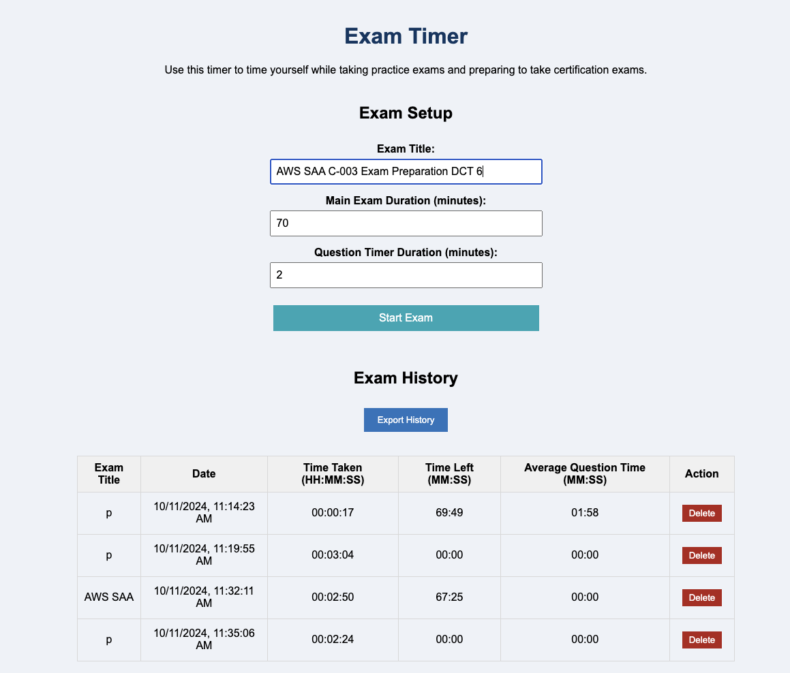
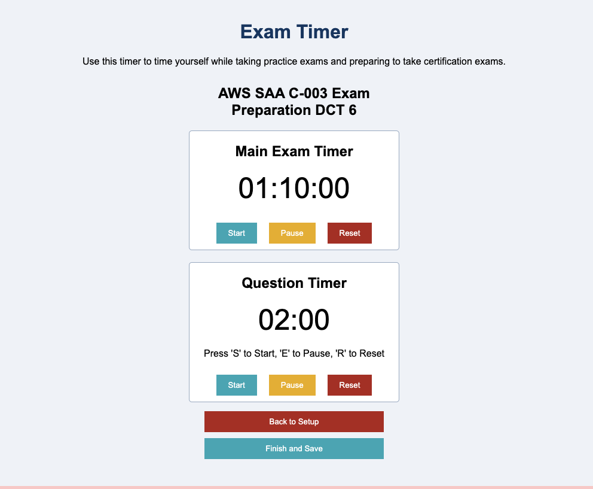

# Exam Timer

This is a simple exam timer that can be used to help you prepare for certification exams.

## Features

- Set the total time for the exam
- Set the time for each question
- Start the timer
- Pause the timer
- Reset the timer
- Get a notification when the time is up

The app will keep track of your overall time working through the exam, as well as each question. You can use the question timer to help you pace yourself as you work through the exam, and the overall timer to help you stay on track. The app will notify you when the time is up for each question. A history of the overall time and time spent on each question is displayed at the bottom of the page and can be exported to a CSV file.

## How to use

1. Clone the repository
2. Run `npm install` in the root directory. Open localhost:3000 in your browser
3. Enter the name of the exam
4. Set the total time for the exam
5. Set the time for each question
6. Click the `Start` button to start the overall exam timer
7. Click the `Pause` button to pause the timer
8. Click the `Reset` button to reset the timer
9. Use an question timer for each question

The app will notify you when the time is up for each question with a gentle sound. Click "Finish and Save" when you're done to save the history of the exam to a CSV file.

## Screenshots

## Technologies

- React
- Node.js

## License

This project is licensed under the MIT License.

